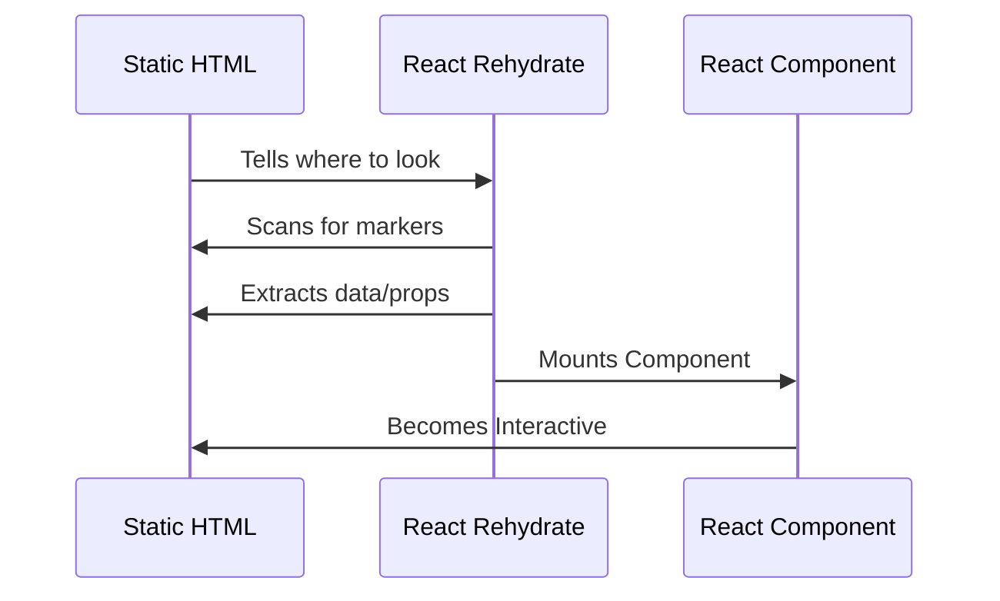

# Architectural Blueprint: The Controlled Handover

Building for the web is a balance. Should your page be fast and static, or powerful and interactive? We believe you shouldn't have to choose.

`react-rehydrate` is built on the core principle of **[Progressive Enhancement](https://web.dev/progressive-enhancement/)**: start with a solid, high-performance foundation (HTML) and upgrade only what's necessary (React).

---

## 🧭 Which path are you on?

**The "Standard" Way (SPA)**  
The browser downloads a giant JavaScript file. The screen stays white. Then, JavaSript builds the entire page from scratch.  
*Results: Fast once loaded, but slow for SEO and first-time users.*

**The "Rehydrate" Way (Islands)**  
The server sends a fully built HTML page. It's visible and readable **instantly**. React then "wakes up" only the specific parts that need to be interactive.  
*Results: Perfect SEO, instant reading, and powerful interactivity where it counts.*

---

## 🏛️ The Analogy: The Museum Tour Guide

If your website is a **Historic Museum** (your existing site):

1.  **Don't demolish it.** You don't need to rebuild the whole building just to add a new interactive exhibit.
2.  **Add "Smart Markers."** Place a small sign (a data-attribute) where you want a new interactive feature.
3.  **The Tour Guide (Rehydrator).** Our library acts as a guide. It walks through the museum once, finds your markers, and installs your React "exhibits" exactly where they belong.

**The museum stays historic, but the experience feels futuristic.**

---

## 🔄 The 3-Step Handover
Our architecture follows a strictly managed sequence. Here is what happens when a user lands on your page:

1.  **Discovery (The Scan):** The library performs a quick scan for your `[data-react-from-markup-container]` markers.
2.  **Bridge (The Props):** It extracts any data you've stored in attributes (like `data-count="5"`) and prepares them as props for React.
3.  **Takeover (The Hydration):** React takes control of just that specific section.

---

## 🛡️ Security: The "Air-Gap" Strategy

In a normal React app, one small error or security bug can crash or compromise the **entire** page. We use a strategy called **Island Isolation**.

*   **Safety Boundaries:** Each interactive section (Island) is independent. If a "Like" button crashes, it won't break your "Checkout" flow.
*   **XSS Protection:** Because each "Island" is its own root, it's much harder for a security vulnerability in one component to peek into or steal data from another.

---

## 🌍 Why the World's Best Products use this

When you build for millions of users, you need two things: **Speed** and **Safety**.

*   **O(n) Discovery:** Our scanning logic is extremely fast and won't freeze your user's browser, even on slow phones.
*   **Green Memory (Digital Sustainability):** MNCs are now prioritizing ESG (Environmental, Social, and Governance) goals. By avoiding a full-page "Virtual DOM" and only using RAM for active Islands, we reduce the carbon footprint of your application by lowering CPU and battery drain on millions of user devices.
*   **Low Risk:** You can add React to your existing site one button at a time. No "Big Bang" rewrite required.

[Next: Deep Dive into Value Propositions](/guides/value-proposition)
