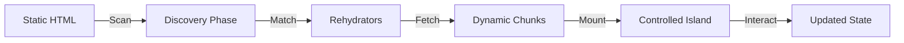

# React Rehydrate
**The Bridge to Modernity: Control High-Performance React 19 Components from your Static Layouts.**

`react-rehydrate` is a professional-grade architectural bridge designed for enterprise ecosystems (CMS, Legacy E-commerce, or Monolithic Portals). It enables you to inject modern React interactivity into any HTML-first environment without the risk of a full-stack migration.

## 🏝️ Island Architecture: Selective & Resumable Hydration

Modern engineering is moving away from Monolithic SPAs toward **Selective Hydration**. `react-rehydrate` provides an architectural framework to implement this pattern in any legacy system:

- **Static Shell Strategy**: Your server delivers 100% semantic HTML for instant indexing and SEO dominance.
- **Interactive Islands (Isomorphism)**: React roots "rehydrate" only high-value interactive zones.
- **Selective Hydration**: Only code present on the page is loaded and executed via dynamic imports.
- **Resource Priority**: Defer non-critical widgets while prioritizing LCP-critical interactivity.

---

### Enterprise Technical Comparison Matrix

| Technical Dimension | React Rehydrate (Controlled Islands) | Legacy Monolith (jQuery/Server) | Modern SPA (Next/CRA/Vite) |
| :--- | :--- | :--- | :--- |
| **SEO & Indexability** | ✅ Native / Instant | ✅ Perfect | ⚠️ High SSR Overhead |
| **SMM Previews (OG Tags)** | ✅ Static-First Ready | ✅ Perfect | ⚠️ Virtual / Meta Tags |
| **Hydration Strategy** | ✅ Selective & Fragmented | ❌ None | ⚠️ Full Body Re-render |
| **Core Web Vitals (CLS)** | ✅ Zero-CLS Stability | ✅ High Stability | ❌ Frequent Hydration Shifts |
| **Content Security Policy** | ✅ Sanitized Bridge Root | ❌ Large Attack Surface | ⚠️ Moderate |
| **Time to Interactive (TTI)** | ✅ Optimized Selective Loading | ✅ Fast | ❌ Slow (Total JS Execution) |
| **Memory Lifecycle** | ✅ Disposable / GC-Ready Roots | ✅ Efficient | ⚠️ Risk of Memory Leaks |
| **Development Experience** | ✅ Full Vite / HMR Support | ❌ Poor / Stale | ✅ Excellent |
| **Legacy JS Interop** | ✅ Isolated Root Coexistence | ✅ Native | ❌ High Conflict |
| **Micro-Frontend Autonomy** | ✅ Drop-in Independent Roots | ❌ Monolithic | ⚠️ Orchestrated |
| **Production Resilience** | ✅ Multi-root Error Isolation | ❌ No Safety Boundaries | ✅ High |
| **Discovery Performance** | ✅ O(n) Non-blocking Scan | ✅ Instant | ❌ High Overhead |
| **React 19 Native Actions** | ✅ Full Modern Hook Support | ❌ Incompatible | ✅ Native |

---

## ⚡ React Rehydrate vs. React Server Components (RSC)

| Dimension | React Rehydrate | React Server Components (RSC) |
| :--- | :--- | :--- |
| **Target Environment** | Brownfield / Legacy / Any CMS | Greenfield / Modern Server |
| **Server Requirement** | Any (PHP, Ruby, .NET, Static) | Node.js (High integration) |
| **Build Dependency** | Low (Bridge-only architecture) | High (Bundler-heavy) |
| **Hydration Pattern** | Selective / Partially Resumable | Streamed |
| **Legacy Interop** | ✅ Excellence by Design | ❌ High Friction |
| **HMR Latency** | ✅ Near-Zero (Vite-powered) | Low |

---

## 🏗️ Architectural Lifecycle & Middleware

`react-rehydrate` implements a strictly managed handover between the static DOM and React:

### 1. The Rehydrator Transform Pattern
We explicitly decouple your components from the DOM. A **Rehydrator** is an asynchronous middleware layer that acts as a transform between human-readable markup and component props. This keeps your React library platform-agnostic.

### 2. Multi-Root Fault Tolerance
By using independent **React Roots**, we provide "domain isolation." A crash in a non-critical sidebar widget cannot brick your checkout flow or global navigation. This is essential for high-availability enterprise sites.

### 3. Sustainability & Efficiency
By executing less JavaScript and avoiding full page re-renders, `react-rehydrate` reduces CPU cycles and energy consumption. This is a step toward a high-performance, sustainability-focused frontend.

---

## 🚀 Why React Rehydrate vs. Other Libraries?

| High-Level Feature | React Rehydrate | Legacy `react-from-markup` | Frameworks (Astro/Qwik) |
| :--- | :--- | :--- | :--- |
| **React 18/19 Support** | ✅ Cutting Edge (React 19) | ❌ Stale (V16) | ✅ Full |
| **Migration Risk** | ✅ Zero-Friction Drop-in | Low | ❌ High (Total rewrite) |
| **Build System** | ✅ Build System Agnostic | ✅ Any | ❌ Strict pipeline lock-in |
| **Nested Strategy** | ✅ Native Recursive Support | ❌ None | ⚠️ Recursive difficulty |
| **Resumability Support** | ✅ Partial (Post-Discovery) | ❌ No | ✅ Selective |

---

## 📖 Deep Dives

- [**The Blueprint**](/architecture) — Architectural overview & value proposition.
- [**Installation**](/installation) — Get started in under 5 minutes.
- [**Script Integration**](/guides/script-integration) — The path to drop-in interactivity.
- [**Core Fundamentals**](/containers) — Mastering containers & rehydrators.
- [**Advanced Patterns**](/rehydrators/dynamic-rehydratable-name) — Dynamic resolution & async loading.
- [**React 19 Demos**](/demos/index) — Engineering examples in action.
